# MOVIE
## 메인페이지

  
메인 페이지 로그인 전

  

  
메인 페이지 로그인 후

  
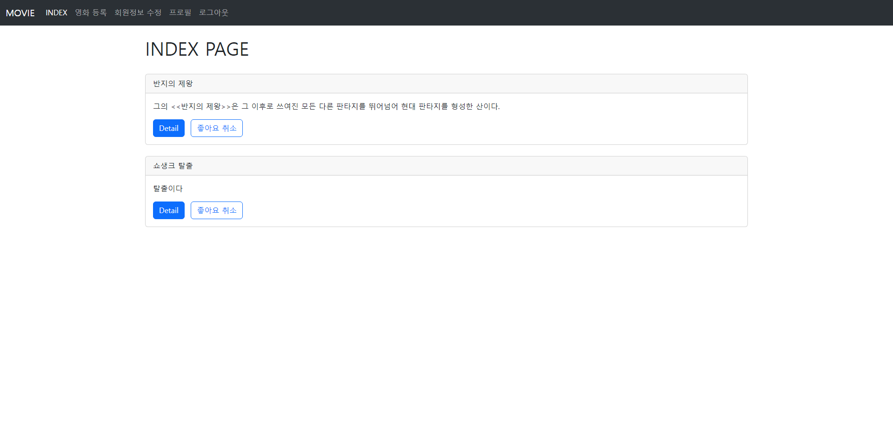

## 로그인 페이지

  
로그인 페이지

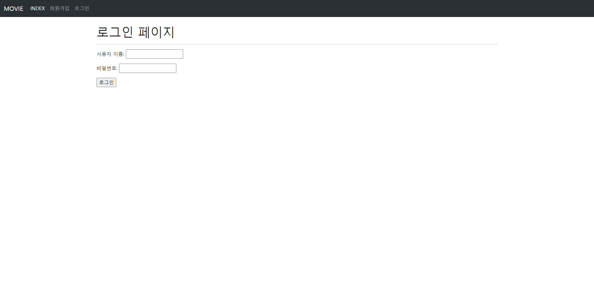

## 회원가입 페이지

  
회원가입 페이지

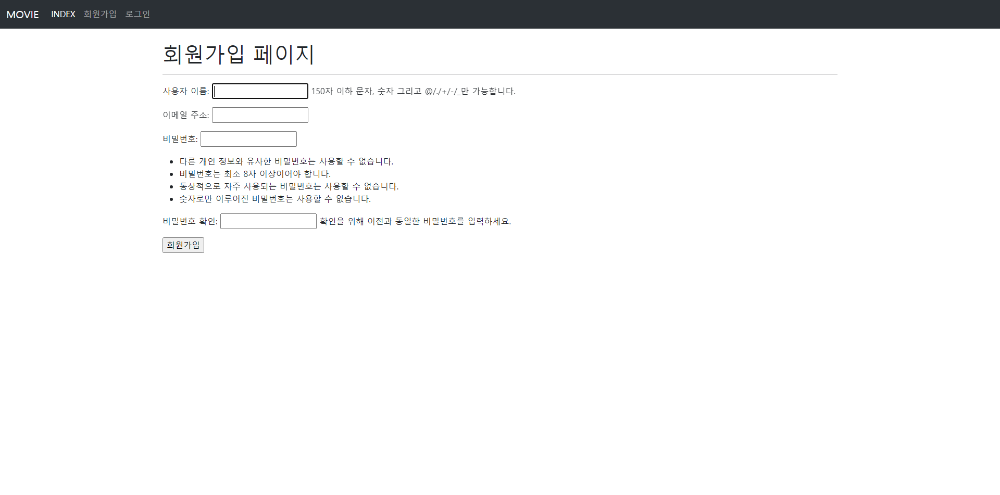

## 영화 등록 페이지

  
영화 등록 페이지

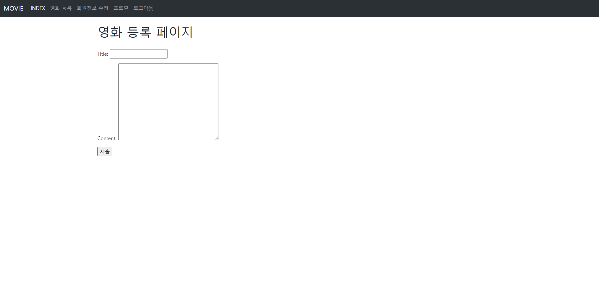

## 영화 상세 페이지

  
댓글이 없을 때

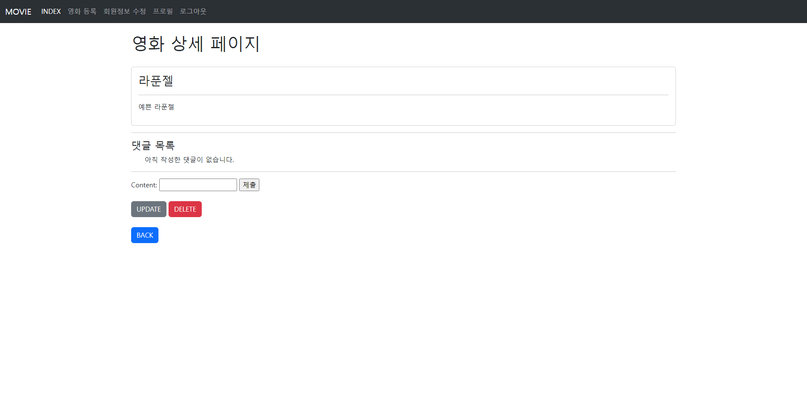

  
댓글이 있을 때

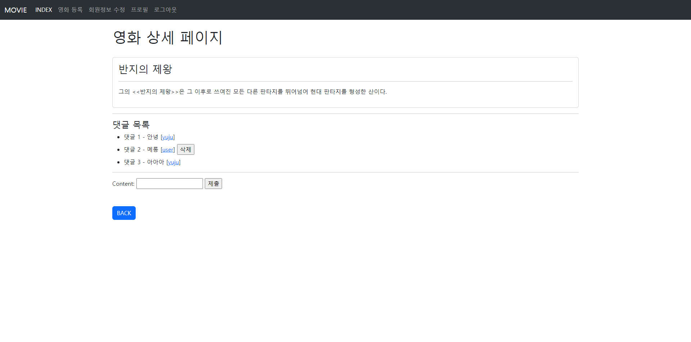

## 영화 수정 페이지

  
영화 수정 페이지

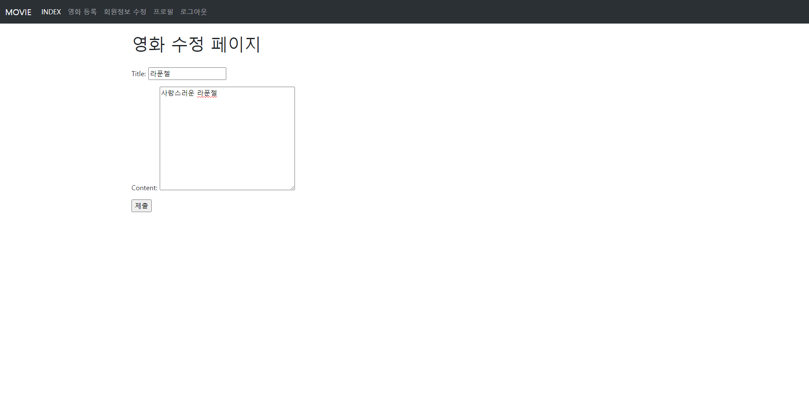

## 회원 정보 수정 페이지

  
회원 정보 수정 페이지

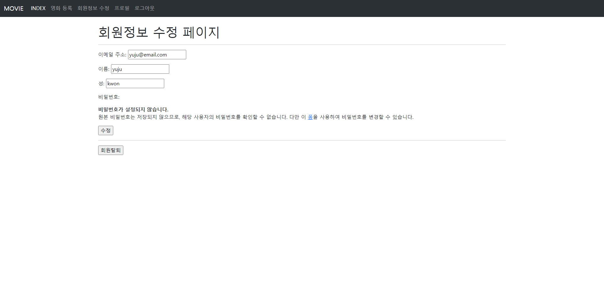

## 비밀번호 변경 페이지

  
비밀번호 변경 페이지

  
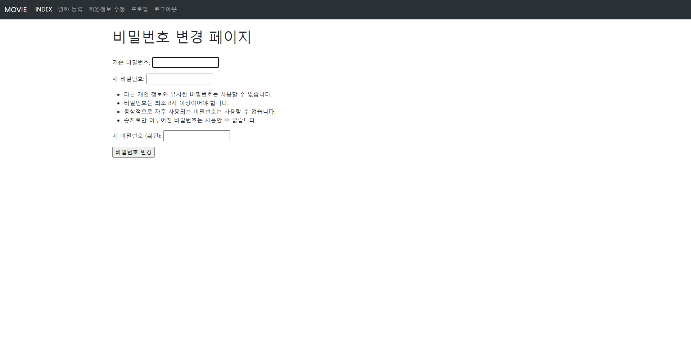

## 프로필 페이지

  
나의 프로필

  
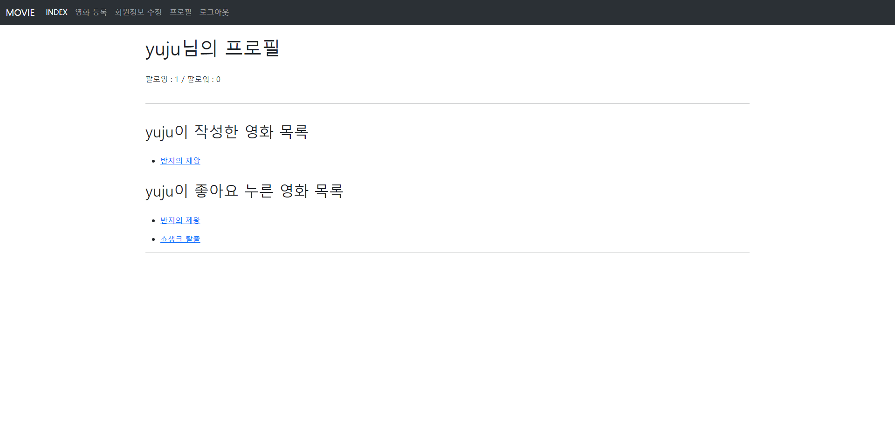

  
다른 사람의 프로필

  
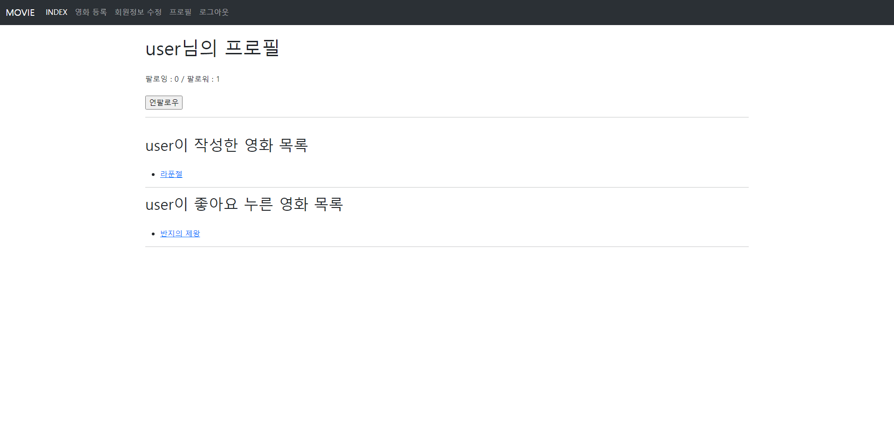

